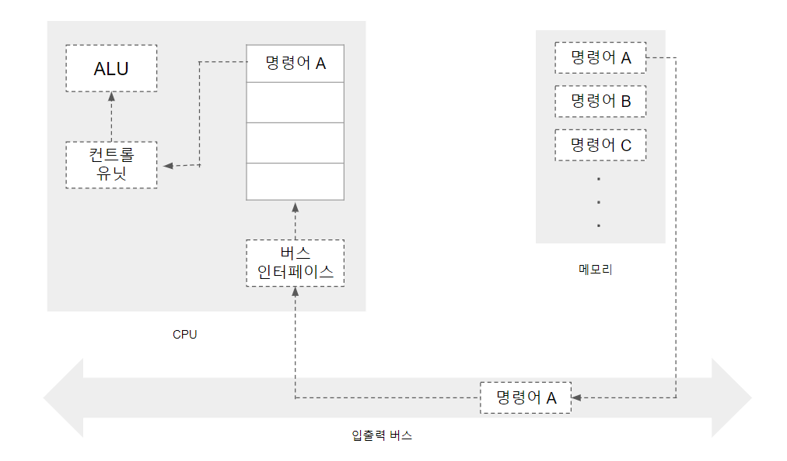

# 윈도우즈 시스템 프로그래밍(시스템 프로그래밍 + 컴퓨터 구조 + 운영체제)

## 64비트와 32비트

- I/O 버스를 통해 한번에 수신할 수 있는 데이터의 크기
- CPU에서 한번에 처리할 수 있는 데이터의 크기
- 32비트 컴퓨터는 한번에 32비트를 받아 처리할 수 있고,  
  64비트 컴큐터는 한번에 64비트를 받아 처리할 수 있음

> - 만약 메모리는 1GB인데 컴퓨터가 4비트라면 메모리가 할당할 수 있는 주소값의 개수는 2의 4제곱에 해당하는 16바이트이기 때문에 비효율적
> - 32비트의 경우 표현할 수 있는 주소의 범위가 4GB
> - 32비트 이상의 주소값을 32비트 컴퓨터에서 처리하려면 2번 이상 나누어 처리해야 하므로 32비트 주소값이 최선의 선택
> - 따라서 프로그래머 입장에선 주소값이 클 수록 좋음

 
 

### 64비트, 32비트 공존의 문제점

- 상기한 것처럼 비트 수가 다르면 연산 처리에 문제가 생기므로 속도 저하 문제가 생길 수 있음
- 같은 자료형도 운영체제, 비트 수에 따라서 크기가 상이함
- 다른 비트 시스템에서 코드를 실행할 때 자료형 크기에 따른 자료 손실이 발생할 수 있음

 
 

### 자료형

- Windows 자료형
  - `typedef 자료형 정의`의 형태로 자료형을 정의할 수 있음
  - 함수를 따로 만들어 관리하는 것처럼 관리에 용이

 
 

> **GetLastError 함수** >  

- 에러코드를 반환하는 함수
- 오류가 발생하지 않은 시스템 함수 호출 후에도 에러코드가 갱신
- 오류가 발생하는 코드 직후에 실행해야 함

 
 

## 컴퓨터 구조 접근방법

 

### 레지스터 디자인

 

> 다음은 레지스터를 디자인하는데 있어서 결정해야 할 중요 요소임

1. 레지스터를 몇 비트로 구성할 것인가?

 

2. 몇 개로 구성할 것인가?

 

3. 각각 무슨 용도로 사용할 것인가?

 

> 16비트, 8개로 디자인한다고 가정하자

- 0~7번 레지스터가 존재
  | | |
  | :-: | :----------------------: |
  | 0번 |
  | 1번 |
  | 2번 |
  | 3번 |
  | 4번 | ir(instruction register) |
  | 5번 | sp(stack pointer) |
  | 6번 | lr(link register) |
  | 7번 | pc(program counter) |

 

> 명령어 구조 및 명령어를 디자인하자

- 레지스터가 16비트이기 때문에 명령어도 16비트
- 16비트 내부에 필요한 내용
  - 예약
  - 저장할 공간
  - 피연산자1
  - 피연산자2
  - 연산자
- 16칸에 위 내용들을 적절히 분배해야함
  - 예약
    - 일단 2칸 할당
  - 저장 공간
    - 8개의 레지스터가 존재하기 때문에 이를 표현하기 위해 3칸 할당
  - 피연산자1
    - 레지스터에 저장된 정보 또는 새로운 숫자
    - 레지스터와 숫자를 구분해야 할 필요가 있으므로 3칸 + 구분을 위한 1칸 = 4칸 할당
  - 피연산자2
    - 4칸 할당
  - 연산자
    - 남은 3칸을 할당하여 8개의 연산자를 표현

> 예시

- 1번 레지스터(`1001 맨앞이 0이면 숫자 1이면 레지스터`)와 7(`0111`)을 더해(`001을 ADD라고 하자`) 2번 레지스터(`010`)에 저장
  |||||||||||||||||||||
  :--:|:--:|:--:|:--:|:--:|:--:|:--:|:--:|:--:|:--:|:--:|:--:|:--:|:--:|:--:|:--:|:--:|:--:|:--:|:--:|
  예|약||연|산|자||저|장|소||피|연|산|자||피|연|산|자
  0|0||0|0|1||0|1|0||1|0|0|1||0|1|1|1|

> 위에서 표현된 명령어는 컨트롤 유닛으로 전달되어 의믹 해석되고, CPU의 각 모듈에 명령을 내려 연산 실행

 
