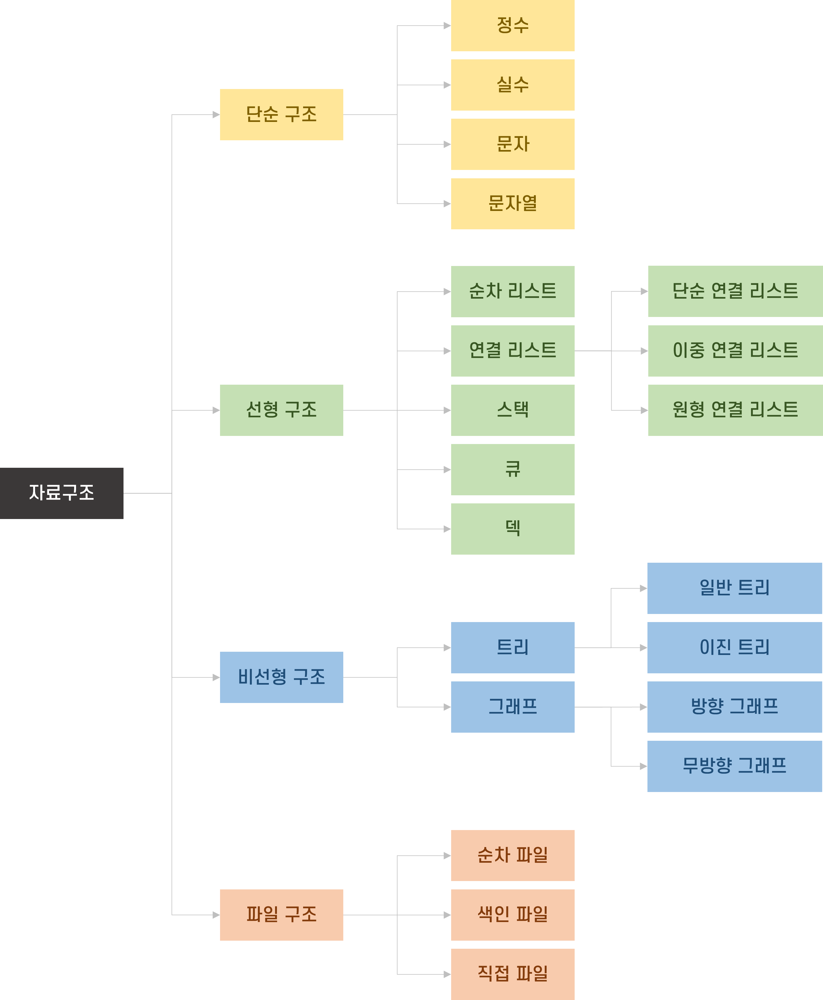
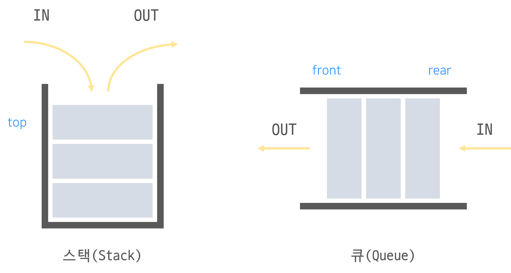

# 🧪 Data Structure (자료구조)

###### content
- [자료구조란?](#자료구조란) 
  - 정의
  - 특징
  - 분류
- [List (리스트)](#list-리스트)  
- [Array (배열)](#array-배열)  
- [Stack(스택) & Queue(큐)](#stack-스택-queue-큐)  
 
 
 

---
## 자료구조란?

### "자료구조"에 대한 다양한 정의

- 자료의 집합. 데이터 값의 모임.
- 데이터의 표현 및 저장 방법을 의미한다.
- 대량의 데이터를 효율적으로 관리하기 위해 데이터를 저장 및 정렬하는 방식이다.
- 각 데이터들이 논리적으로 정의된 규칙에 의해 나열되며 자료에 대한 처리를 효율적으로 수행할 수 있도록 자료를 구분하여 표현한 것이다.
- 자료구조는 컴퓨터 과학에서 효율적인 접근 및 수정을 가능케 하는 자료의 조직, 관리, 저장을 의미한다.
- 자료 구조는 데이터 값의 모임, 데이터 간의 관계, 그리고 데이터에 적용할 수 있는 함수나 명령을 의미한다.
- 자료를 효율적으로 관리하기 위해서 자료를 성질에 따라 분류하고 처리하여 저장하는 모든 작업을 의미한다.  
 

### 자료구조의 특징
- 효율성
- 추상화
- 재사용성  
 

### 자료구조의 분류
자료구조의 종류는 단순구조, 선형구조, 비선형구조, 파일구조가 있다.

- #### 단순구조
  자료형의 따라 분류  
  True/False, 정수, 실수, 문자 및 문자열과 같이 컴퓨터가 기본적으로 제공하는 자료형

- #### 선형구조
  자료 간 관계가 1대1  
  데이터들이 일렬로 쭉 저장되어 있는 형태

- #### 비선형구조
  자료 간 관계가 1대다 혹은 다대다  
  계층구조(Hierarchy)나 망구조(Network Structure)를 갖는 자료구조

- #### 파일구조
  서로 관련있는 필드(Field)로 구성된 레코드(Record)집합인 파일에 대한 자료구조  
  보조 기억장치에 데이터가 실제로 기록되는 형태  
 
 

 
 
 

##### [🔼 목차로 이동](#content)
---
## List (리스트)

### 리스트(list) 란?
- 순서를 가지고 일렬로 나열한 원소들의 모임  
- 순서를 가진 데이터의 집합
 

### 리스트(list)의 특징
- 순서가 있다는 점에서 집합과는 구별되며, 갈림길 없이 일렬로 나열되어 처음과 끝이 각각 하나씩만 있다는 점에서 그래프와도 구별된다.  
- 크기가 고정되어 있지 않다.
- 중복 값이 허용된다.
- 데이터(값)들이 순차적으로 메모리에 저장되어 있는 구조
&rarr; 자료 구조로 크기 조정이 불가능한 배열의 한계를 극복할 수 있다. (Java의 ArrayList, Python의 List)  
 

### 리스트(list) 분류
리스트는 구현 방법에 따라 크게 순차 리스트(Sequential List)와 연결 리스트(Linked List)로 분류된다.  

- 순차 리스트 : 배열을 기반으로 구현된 리스트. 선형 리스트라고도 한다. (Array, Array List)
- 연결 리스트 : 메모리의 동적 할당을 기반으로 구현된 리스트  
 

### 💡 순차 리스트와 연결 리스트 비교

|순차 리스트|연결리스트|
|:---:|:---:|
|배열로 구현|메모리의 동적 할당 기법을 이용해 구현|
|논리적 순서와 물리적 순서가 같은 구조|각 노드에 저장된 다음 노드의 주소에 의해 연결된 구조|
|삽입, 삭제 시 물리적 순서를 맞추기 위해 데이터의 이동 발생(오버헤드 O)|삽입, 삭제 시 위치 정보만 보유/해제하므로 데이터 이동 없음(오버헤드 발생 X)|

 
 
 

##### [🔼 목차로 이동](#content)
---
## Array (배열)

### 배열(Array) 란?  
- 연속된 메모리 공간에 순차적으로 저장된 데이터 모음
- 인덱스(index)를 가지며, 이 인덱스에 의해 접근이 가능한 순차적으로 구성된 자료구조  
 

### 배열(Array)의 특징

- 논리적 저장 순서와 물리적 저장 순서가 일치한다.  
- 인덱스(index)로 데이터(element)에 접근할 수 있다. (랜덤 엑세스가 가능하다)
- 하나의 변수에 여러 정보들을 담을 수 있다.
- 반복문과 결합하면 많은 데이터를 효율적으로 처리할 수 있다.
- 빈 값이 허용되고, 중복 값도 허용된다.

#### 장점
- 인덱스(index)로 접근할 수 있어 데이터 조회 속도가 빠르다.
- 추가적인 메모리 공간이 필요하지 않다.

#### 단점
- 크기가 고정되어 있므로 크기를 미리 알아야 하며 확장이 불가능하다.
- 배열의 크기가 데이터의 수보다 클 수 있다. &rarr; 메모리 공간이 낭비될 수 있다.
- 삽입, 삭제가 되는 경우, 순서를 갱신해줘야 하기 때문에 데이터의 이동이 필요하여 오버헤드(overhead)가 발생할 수 있다. (삽입, 삭제 연산 후 연속적인 물리 주소를 유지하기 위해 데이터의 이동이 발생)  
 

💡 오버헤드(overhead) 란?  
어떤 처리를 하기 위해 들어가는 간접적인 처리 시간 &middot; 메모리 등  
 
 
 

##### [🔼 목차로 이동](#content)
---
## Stack(스택) & Queue(큐)
 

 

## 스택(Stack) 이란?
- 제한적으로 접근할 수 있는 나열 구조
- 한 쪽 끝에서만 자료를 넣거나 뺄 수 있는 선형 구조
 

### 스택(Stack)의 특징
- LIFO (Last In First Out)
- 가장 최근에 삽입된 자료의 위치를 top 이라 한다.
- 스택의 맨 위 요소(top)에만 접근이 가능하기 때문에 top이 아닌 위치의 데이터에 대한 접근, 삽입, 삭제는 모두 불가능하다.
- top위치의 데이터에 바로 접근이 가능하기 때문에 데이터 삽입, 삭제의 시간 복잡도는 O(1)이다.
- top을 통해 접근하기 때문에 데이터 접근, 삽입, 삭제가 빠르다
- top 이외의 위치의 데이터를 탐색하려면 모든 데이터를 꺼내면서 진행해야 한다.
 

### 스택(Stack)의 연산
- push() : item 하나를 스택의 가장 윗 부분에 추가
- pop() : 스택에서 가장 위에 있는 항목 제거
- peek() : 스택의 가장 위에 있는 항목 반환
- isEmpty() : 스택이 비어 있을 때 true 반환

### 스택(Stack) 활용 예시
- 웹브라우저 방문기록 (뒤로가기) : 가장 마지막에 방문한 페이지부터 뒤로가기 
- 실행 취소 (undo) : 가장 마지막에 실행된 것부터 실행 취소
- 자바스크립트 Call Stack
- 연산자 후위 표기법  
- 문자열 역순 출력
 
 

## 큐(Queue) 란?
- 먼저 집어 넣은 데이터가 먼저 나오는 구조
- 양쪽 끝에서 데이터의 삽입과 삭제가 각각 이루어지는 선형 구조
 

### 큐(Queue)의 특징
- FIFO (First In First Out)
- 큐의 가장 첫 원소를 front, 끝 원소를 rear 라고 한다. (데이터가 삽입되는 곳을 rear, 데이터가 제거되는 곳을 front)
- 선형 큐(Linear Queue)와 원형 큐(Circular Queue)가 있다.
- front, rear의 위치로 데이터 삽입 삭제가 바로 이루어지기 때문에 원소 삽입, 삭제의 시간 복잡도는 O(1)이다.
- 데이터 접근, 삽입, 삭제가 빠르다.
- 스택과 마찬가지로 중간에 위치한 데이터에 대한 접근이 불가능하다.
 

### 큐(Queue)이 연산
- add(): item을 리스트의 끝부분에 추가
- remove(): 리스트의 첫 번째 항목 제거
- peek(): 큐에서 가장 위에 있는 항목 반환
- isEmpty(): 큐가 비어 있을 때 true 반환

### 큐(Queue) 활용 예시
- Buffer  
- 캐시(Cache) 구현
- 데이터가 입력된 시간 순서대로 처리할 경우
- 콜센터 고객 대기시간 (대기순서 관리)
 
