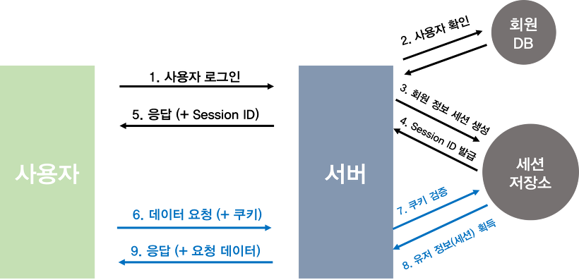
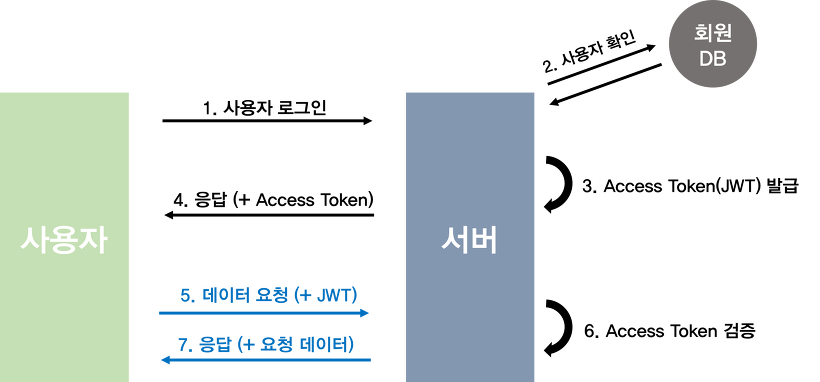
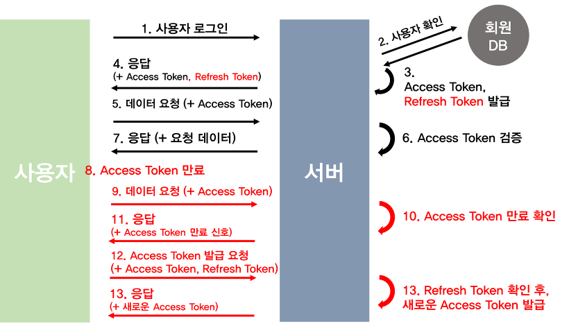
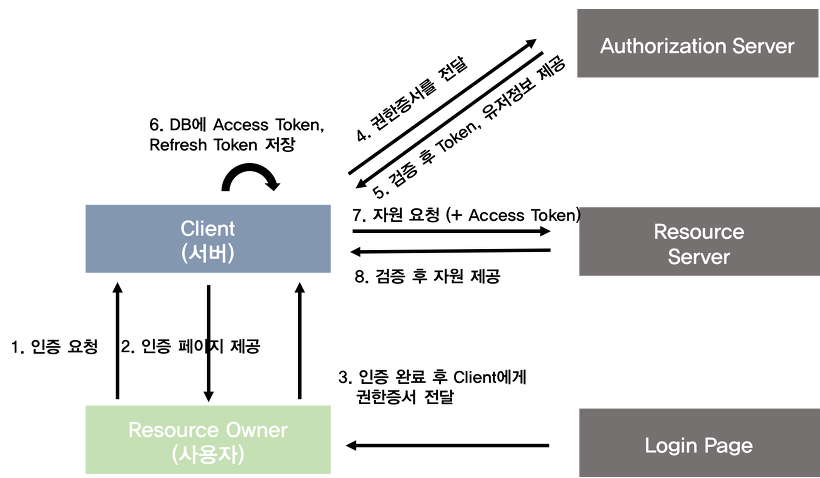

# 🎸 ETC

###### content
- [JWT와 로그인 프로세스 구현 시 고려할 점](#jwt와-로그인-프로세스-구현-시-고려할-점) 
<br>
<br>
<br>

---
## JWT와 로그인 프로세스 구현 시 고려할 점

### ■ JWT (JSON Web Token)
- 인증에 필요한 정보들을 암호화시킨 토큰
- JWT를 생성하기 위해서는 Header, Payload, Verify Signature 객체 필요
  - Header : 토큰 종류와 해시 알고리즘 정보
  - Payload : 토큰의 내용물이 인코딩된 부분
  - Signature : 일련의 문자열, 시그니처를 통해 토큰이 변조되었는지 여부를 확인

  

<br>
<br>

### ■ 로그인 인증 구현 방법들
#### 방법 1) ```세션과 쿠키```를 이용한 인증  


###### 이미지출처 : https://velog.io/@gusdnr814/%EB%A1%9C%EA%B7%B8%EC%9D%B8-%EC%9D%B8%EC%A6%9D-4%EA%B0%80%EC%A7%80-%EB%B0%A9%EB%B2%95#%EC%84%B8%EC%85%98%EA%B3%BC-%EC%BF%A0%ED%82%A4%EB%A5%BC-%EC%9D%B4%EC%9A%A9%ED%95%9C-%EC%9D%B8%EC%A6%9D
<br>

#### 방법 2) ```Access Token```을 이용한 인증  
  

###### 이미지출처 : https://velog.io/@gusdnr814/%EB%A1%9C%EA%B7%B8%EC%9D%B8-%EC%9D%B8%EC%A6%9D-4%EA%B0%80%EC%A7%80-%EB%B0%A9%EB%B2%95#%EC%84%B8%EC%85%98%EA%B3%BC-%EC%BF%A0%ED%82%A4%EB%A5%BC-%EC%9D%B4%EC%9A%A9%ED%95%9C-%EC%9D%B8%EC%A6%9D
<br>

#### 방법 3) ```Access Token + Refresh Token```을 이용한 인증  
  

###### 이미지출처 : https://velog.io/@gusdnr814/%EB%A1%9C%EA%B7%B8%EC%9D%B8-%EC%9D%B8%EC%A6%9D-4%EA%B0%80%EC%A7%80-%EB%B0%A9%EB%B2%95#%EC%84%B8%EC%85%98%EA%B3%BC-%EC%BF%A0%ED%82%A4%EB%A5%BC-%EC%9D%B4%EC%9A%A9%ED%95%9C-%EC%9D%B8%EC%A6%9D
<br>

#### 방법 4) ```OAuth 2.0```을 이용한 인증  
  

###### 이미지출처 : https://velog.io/@gusdnr814/%EB%A1%9C%EA%B7%B8%EC%9D%B8-%EC%9D%B8%EC%A6%9D-4%EA%B0%80%EC%A7%80-%EB%B0%A9%EB%B2%95#%EC%84%B8%EC%85%98%EA%B3%BC-%EC%BF%A0%ED%82%A4%EB%A5%BC-%EC%9D%B4%EC%9A%A9%ED%95%9C-%EC%9D%B8%EC%A6%9D

<br>
<br>
<br>

### ■ 브러우저 저장소 종류
#### 1) ```Local Storage```
- 브라우저 저장소에 저장하는 방식
- 간단한 키와 값을 저장할 수 있는 저장소
- Javascript 내 글로벌 변수로 읽기, 쓰기 접근이 가능 (window 객체로 접근 가능)
- 사용자가 지우지 않는 이상 데이터는 영구적

😈 SessionID, refreshToken 또는 accessToken를 Local Storage에 저장 시 XSS 취약점을 통해 그 안에 담긴 값을 불러오거나 불러온 값을 이용해 API 호출을 위조 가능
<br>
<br>

#### 2) ```Session Storage```
- 윈도우, 탭 닫을 시 데이터 제거
- 간단한 키와 값을 저장할 수 있는 저장소
- Javascript 내 글로벌 변수로 읽기, 쓰기 접근이 가능 (window 객체로 접근 가능)

😈 XSS 공격에 매우 취약
<br>
<br>

#### 3) ```Cookies```
- 브라우저에 쿠키로 저장
- 클라이언트가 HTTP 요청을 보낼 때마다 자동으로 쿠키가 서버에 전송 
- Javascript 내 글로벌 변수로 읽기 / 쓰기 접근 가능  

😈 SessionID, refreshToken, accessToken을 저장해두면 XSS 취약점이 있을 때 담긴 값들을 불러오거나, API 콜을 보내면 쿠키에 담긴 값들이 함께 전송되어 로그인한 척 공격을 수행 가능  

😈 쿠키에 세션 id나 accessToken을 저장해 인증에 이용하는 구조에 CSRF 취약점이 있다면 인증 정보가 쿠키에 담겨 서버로 보내지고, 공격자는 유저 권한으로 정보를 가져오거나 액션을 수행 가능
<br>
<br>

#### 4) ```Secure, httpOnly (Cookies)```
- 브라우저에 쿠키로 저장되는 건 같지만, Javascript 내에서 접근이 불가능
- secure을 적용하면 https 접속에서만 동작
- httpOnly 쿠키 방식으로 저장된 정보는 XSS 취약점 공격으로 담긴 값을 불러올 수 없음
- refreshToken만 저장하고 accessToken을 받아와 인증에 이용하는 구조로 CSRF 공격 방어 가능  

😈 httpOnly 쿠키에 담긴 값에 접근할 수는 없지만 XSS 취약점을 노려 API를 요청하면 httpOnly 쿠키에 담긴 값들도 함께 보내져 유저인 척 정보를 빼오거나 액션을 수행 가능

<br>
<br>
<br>


### 참고 자료 & 함께 보면 좋은 자료
[🔗 [블로그] Access Token & Refresh Token 인증 구현](https://cotak.tistory.com/102)  
[🔗 [블로그] 로그인 인증 4가지 방법](https://velog.io/@gusdnr814/%EB%A1%9C%EA%B7%B8%EC%9D%B8-%EC%9D%B8%EC%A6%9D-4%EA%B0%80%EC%A7%80-%EB%B0%A9%EB%B2%95#access-token%EC%9D%84-%EC%9D%B4%EC%9A%A9%ED%95%9C-%EC%9D%B8%EC%A6%9D)  
[🔗 [블로그] 프론트에서 안전하게 로그인 처리하기](https://velog.io/@yaytomato/%ED%94%84%EB%A1%A0%ED%8A%B8%EC%97%90%EC%84%9C-%EC%95%88%EC%A0%84%ED%95%98%EA%B2%8C-%EB%A1%9C%EA%B7%B8%EC%9D%B8-%EC%B2%98%EB%A6%AC%ED%95%98%EA%B8%B0#%F0%9F%A7%9E%E2%99%82%EF%B8%8Ftldr)  
[🔗 [블로그] Login과 관련된 개념](https://nemodiary.netlify.app/react%20-%20login%20process/)  
[🔗 [블로그] 진짜 진짜 마지막 로그인 정리](https://velog.io/@raverana96/react-%EC%A7%84%EC%A7%9C-%EC%A7%84%EC%A7%9C-%EB%A7%88%EC%A7%80%EB%A7%89-%EB%A1%9C%EA%B7%B8%EC%9D%B8-%EC%A0%95%EB%A6%AC#%EC%A0%84%EB%B0%98%EC%A0%81%EC%9D%B8-%ED%94%84%EB%A1%9C%EC%84%B8%EC%8A%A4)  
<br>


##### [🔼 목차로 이동](#content)
---