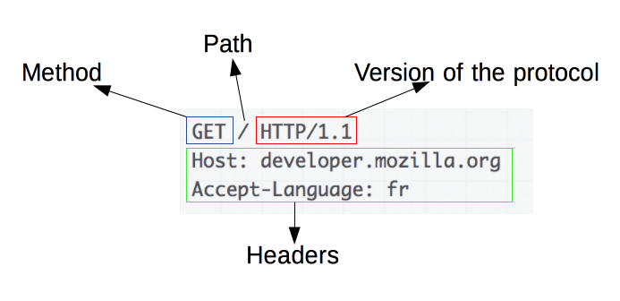

# 📶 Network

###### content

- [TCP와 UDP의 특징과 차이](#tcp와-udp의-특징과-차이)
  - TCP (Transmission Control Protocol)
  - UDP (User Datagram Protocol)
  - TCP와 UDP의 비교
- [HTTP](#http)
  - HTTP 프로토콜이란?
  - HTTP vs HTTPS
  - HTTP 1 vs HTTP 2
- [GET과 POST](#get과-post)
  - GET
  - POST
  - GET과 POST의 차이

 
 
 

---

 

## TCP와 UDP의 특징과 차이

---

 

## TCP (Transmission Control Protocol)

 

- 인터넷상에서 데이터를 메세지의 형태로 보내기 위해 IP와 함께 사용하는 프로토콜

- TCP는 애플리케이션에게 신뢰적이고 연결지향성 서비스를 제공한다. 일반적으로 TCP와 IP는 함께 사용되며 IP는 배달을, TCP는 패킷의 추적 및 관리를 하게 됩니다.

- TCP는 연결형 서비스로, 신뢰적인 전송을 보장하기에 handshaking하고 데이터의 흐름제어와 혼잡제어를 수행합니다. 하지만 이러한 기능으로 인해 TCP의 속도는 느립니다.

 
 

<그림1> 가상회선 패킷 교환 방식

 
 

### TCP 특징

- 연결형 서비스로 가상 회선 방식을 제공한다.
- 3-way handshaking과정을 통해 연결을 설정하고 4-way handshaking을 통해 해제한다.
- 흐름 제어 및 혼잡 제어
- 높은 신뢰성을 보장한다.
- UDP보다 속도가 느리다.
- 전이중(Full-Duplex), 점대점(Point to Point) 방식.
   
   

### TCP 서버의 특징

- 서버소켓은 연결만을 담당한다.
- 연결과정에서 반환된 클라이언트 소켓은 데이터의 송수신에 사용된다형 서비스로 가상 회선 방식을 제공한다.
- 서버와 클라이언트는 1대1로 연결된다.
- 스트림 전송으로 전송 데이터의 크기가 무제한이다.
- 패킷에 대한 응답을 해야하기 때문에(시간 지연, CPU 소모) 성능이 낮다.- Streaming 서비스에 불리하다.(손실된 경우 재전송 요청을 하므로)

 
 

> Q) 패킷(Packet)이란?

> 인터넷 내에서 데이터를 보내기 위한 경로배정(라우팅)을 효율적으로 하기 위해서 데이터를 여러 개의 조각들로 나누어 전송을 하는데 이때, 이 조각을 패킷이라고 합니다.

 
 

> Q) TCP는 패킷을 어떻게 추적 및 관리하나요?

> 위에서 데이터는 패킷단위로 나누어 같은 목적지(IP계층)으로 전송된다고 설명하였습니다. 예를 들어 한줄로 서야하는 A,B,C라는 사람(패킷)들이 서울(발신지)에서 출발하여 부산(수신지)으로 간다고 합시다. 그런데 A,B,C가 순차적으로 가는 상황에서 B가 길을 잘못 들어서 분실되었다고 합시다. 하지만 목적지에서는 A,B,C가 모두 필요한지 모르고 A,C만 보고 다 왔다고 착각할 수 있습니다. 그렇기 때문에 A,B,C라는 패킷에 1,2,3이라는 번호를 부여하여 패킷의 분실 확인과 같은 처리를 하여 목적지에서 재조립을 합니다. 이런 방식으로 TCP는 패킷을 추적하며, 나누어 보내진 데이터를 받고 조립을 할 수 있습니다.

 
 

##### [🔼 목차로 이동](#content)

---

## UDP (User Datagram Protocol)

 

- 데이터를 데이터그램 단위로 처리하는 프로토콜 (데이터그램이란 독립적인 관계를 지니는 패킷이라는 뜻이다.)

- UDP는 비연결형 프로토콜이다. 즉, 할당되는 논리적인 경로가 없고 각각의 패킷이 다른 경로로 전송되고 이 각각의 패킷은 독립적인 관계를 지니게 되는데, 이렇게 데이터를 서로 다른 경로로 독립 처리하는 프로토콜을 UDP 라고 합니다.

- UDP는 연결을 설정하고 해제하는 과정이 존재하지 않는다. 서로 다른 경로로 독립적으로 처리함에도 패킷에 순서를 부여하여 재조립하거나 흐름제어 및 혼잡제어를 수행하지 않아 속도가 빠르며 네트워크 부하가 적다는 장점이 있지만 데이터 전송의 신뢰성이 낮다. 연속성이 중요한 실시간 서비스(스트리밍)에 좋다.

 
 

<그림2> 데이터그램 패킷 교환 방식

 
 

### UDP 특징

- 비연결형 서비스로 데이터그램 방식을 제공한다.
- 정보를 주고 받을 때 정보를 보내거나 받는다는 신호절차를 거치지 않는다.
- UDP헤더의 CheckSum 필드를 통해 최소한의 오류만 검출한다.
- 신뢰성이 낮다.
- TCP보다 속도가 빠르다.

 
 

### UDP 서버의 특징

- UDP에는 연결 자체가 없어서(connect 함수 불필요) 서버 소켓과 클라이언트 소켓의 구분이 없다.
- 소켓 대신 IP를 기반으로 데이터를 전송한다.
- 서버와 클라이언트는 1대1, 1대N, N대M 등으로 연결될 수 있다.
- 데이터그램(메세지) 단위로 전송되며 그 크기는 65535바이트로, 크기가 초과하면 잘라서 보낸다.
- 흐름제어(flow control)가 없어서 패킷이 제대로 전송되었는지, 오류가 없는지 확인할 수 없다.
- 파일 전송과 같은 신뢰성이 필요한 서비스보다 성능이 중요시 되는 경우에 사용된다.

 
 

> Q) TCP의 3-Way Handshake란?

> 3-Way Handshake 방식은 서로의 통신을 위한 관문(port)을 확인하고 연결하기 위하여 3번의 요청/응답 후에 연결이 되는 것을 말합니다. TCP 통신을 이용하여 데이터를 전송하기 위해 네트워크 연결을 설정(Connection Establish) 하는 과정으로 양쪽 모두 데이터를 전송할 준비가 되었다는 것을 보장하고, 실제로 데이터 전달이 시작하기 전에 한 쪽이 다른 쪽이 준비되었다는 것을 알 수 있도록 한다. 즉, TCP/IP 프로토콜을 이용해서 통신을 하는 응용 프로그램이 데이터를 전송하기 전에 먼저 정확한 전송을 보장하기 위해 상대방 컴퓨터와 사전에 세션을 수립하는 과정을 의미한다.

<그림3> 3-way handshake

 
 

> Q) 흐름제어(Flow Control)와 혼잡제어(Congestion Control)이란?

> 흐름제어는 데이터를 송신하는 곳과 수신하는 곳의 데이터 처리 속도를 조절하여 수신자의 버퍼 오버플로우를 방지하는 것입니다. 예를 들어 송신하는 곳에서 감당이 안되게 데이터를 빠르게 많이 보내면 수신자에서 문제가 발생하기 때문입니다.혼잡제어는 네트워크 내의 패킷 수가 넘치게 증가하지 않도록 방지하는 것입니다. 만약 정보의 소통량이 과다하면 패킷을 조금만 전송하여 혼잡 붕괴 현상이 일어나는 것을 막습니다.

 
 

##### [🔼 목차로 이동](#content)

---

## TCP와 UDP의 비교

 
 

| **프로토콜 종류**  |     **TCP**      |         **UDP**          |
| :----------------: | :--------------: | :----------------------: |
|    **연결방식**    |  연결형 서비스   |     비연결형 서비스      |
| **패킷 교환 방식** |  가상 회선 방식  |     데이터그램 방식      |
|   **전송 순서**    |  전송 순서 보장  | 전송 순서가 바뀔 수 있음 |
| **수신 여부 확인** | 수신 여부를 확인 | 수신여부를 확인하지 않음 |
|   **통신 방식**    |     1:1 통신     |  1:1 OR 1:N OR N:N 통신  |
|     **신뢰성**     |       높다       |           낮다           |
|      **속도**      |      느리다      |          빠르다          |

 
 

<그림4> TCP vs UDP

 
 

> ### ☑ TCP와 UDP의 차이를 설명해주세요.

> TCP는 연결형 서비스로 3-way handshaking 과정을 통해 연결을 설정하기 때문에 높은 신뢰성을 보장하지만, 속도가 비교적 느리다는 단점이 있습니다. 그렇기에 **TCP는 연속성보다 신뢰성있는 전송이 중요할 때에 사용하는 프로토콜**로 예를 들면 파일 전송과 같은 경우에 사용됩니다.
>
> UDP는 비연결형 서비스로 3-way handshaking을 사용하지 않기 때문에 신뢰성이 떨어지는 단점이 있지만, 데이터 수신 여부를 확인하지 않기 때문에 속도가 빠르다는 장점이 있습니다. 그렇기 때문에 **신뢰성보다는 연속성이 중요한 서비스** 예를 들면 실시간 서비스(streaming)에 자주 사용됩니다.

 
 

##### [🔼 목차로 이동](#content)

 

---

 

## HTTP

---

 

## HTTP 프로토콜이란?

 

- HTTP(Hyper Text Transfer Protocal)이란 서버/클라이언트 모델을 따라 데이터를 주고 받기 위한 프로토콜입니다.
- HTTP는 상태를 가지고 있지 않는 Stateless 프로토콜이며 Method, Path, Version, Headers, Body 등으로 구성됩니다.
- HTTP는 애플리케이션 레벨의 프로토콜로 TCP/IP 위에서 작동합니다.

 
 

### HTTP 메세지

 

- HTTP 메세지는 서버와 클라이언트 간 데이터가 교환되는 방식이다. 메세지 타입은 Request와 Response가 있다.
- HTTP 메세지는 ASCII로 인코딩된 텍스트 정보이며 여러 줄로 되어있다.
- HTTP/2에와서는 최적화와 성능 향상을 위해 HTTP 프레임으로 나누어지게되었다.

 

> HTTP request는 서버가 특정 동작을 취하게끔 만들기 위해 클라이언트에서 전송하는 메시지

 

<그림5> HTTP 요청

 

> HTTP response는 클라이언트의 요청에 대한 서버의 답변

 

<그림6> HTTP 응답

 
 

---

## HTTP vs HTTPS

 

- HTTP는 평문 데이터를 전송하는 프로토콜이기 때문에, HTTP로 비밀번호나 주민번호 등을 주고 받으면 제3자에 의해 조회될 수 있습니다. 이러한 문제를 해결하기 위해 HTTP에 암호화가 추가된 프로토콜이 HTTPS입니다.
- HTTPS에는 대칭키 암호화와 비대칭키 암호화가 모두 사용됩니다. 비대칭키 암/복호화는 비용이 매우 크기 때문에 서버와 클라이언트가 주고받는 모든 메세지를 비대칭키로 암호화하면 오버헤드가 발생할 수 있습니다.
- 그래서 서버와 클라이언트가 최초 1회로 서로 대칭키를 공유하기 위한 과정에서 비대칭키 암호화를 사용하고, 이후에 메세지를 주고 받을 때에는 대칭키 암호화를 사용합니다.

 

<그림7> HTTP 인증

 

1. 클라이언트(브라우저)가 서버로 최초 연결 시도를 함
2. 서버는 공개키(엄밀히는 인증서)를 브라우저에게 넘겨줌
3. 브라우저는 인증서의 유효성을 검사하고 세션키를 발급함
4. 브라우저는 세션키를 보관하며 추가로 서버의 공개키로 세션키를 암호화하여 서버로 전송함
5. 서버는 개인키로 암호화된 세션키를 복호화하여 세션키를 얻음
6. 클라이언트와 서버는 동일한 세션키를 공유하므로 데이터를 전달할 때 세션키로 암호화/복호화를 진행함

> 공개키로 암호화된 메세지는 개인키를 가지고 있어야만 복호화가 가능하기 때문에, 서버(기업)을 제외한 누구도 원본 데이터를 얻을 수 없습니다.

 
 

---

## HTTP 1 vs HTTP 2

 

- HTTP1은 기본적으로 연결당 하나의 요청/응답을 처리하여 다음과 같은 문제를 가지고 있었습니다.

  - HOL(Head Of Line) Blocking (특정 응답 지연): 클라이언트의 요청과 서버의 응답이 동기화되어 지연 발생
  - RTT(Round Trip TIme) 증가 (양방향 지연): 패킷 왕복 시간의 지연 발생
  - 헤더 크기의 비대: 쿠키 등과 같은 메타데이터에 의해 헤더가 비대해짐

 

- HTTP2는 다음과 같은 기술을 사용하여 HTTP1의 성능 문제를 해결하였습니다.

  - Multiplexed Streams: 하나의 커넥션으로 여러 개의 메세지를 동시에 주고 받을 수 있음
  - Stream Prioritization: 요청온 리소스간의 의존관계를 설정하여 먼저 응답해야하는 리소스를 우선적으로 반환함
  - Header Compression: 헤더 정보를 HPACK 압축 방식을 이용하여 압축 전송함
  - Server Push: HTML문서 상에 필요한 리소스를 클라이언트 요청없이 보내줄 수 있음

 

<그림8> HTTP 1.1 vs HTTP 2

 
 

> ### ☑ HTTP와 HTTPS의 차이점을 설명해주세요.

> HTTP는 평문 데이터를 전송하는 프로토콜이기 때문에, HTTP로 중요한 정보를 주고 받으면 제 3자에 의해 조회될 수 있습니다. 이러한 문제를 해결하기 위해 HTTP에 암호화가 추가된 프로토콜이 HTTPS입니다.
>
> HTTPS는 SSL의 껍질을 덮어쓴 HTTP라고 할 수 있습니다.
> HTTP는 원래 TCP와 직접 통신했지만, HTTPS에서 HTTP는 SSL과 통신하고 SSL이 TCP와 통신함으로써 암호화와 증명서, 안전성 보호를 이용할 수 있게 됩니다.
>
> ※ SSL(Secure Socket Layer) 인터넷을 통해 전달되는 정보를 보호하기 위해 개발한 통신 규약

 
 

##### [🔼 목차로 이동](#content)

 

---

 

## GET과 POST

 

HTTP는 웹상에서 클라이언트와 서버 간에 요청/응답으로 데이터를 주고 받을 수 있는 프로토콜입니다. 클라이언트가 HTTP 프로토콜을 통해 서버에게 요청을 보내면 서버는 요청에 맞는 응답을 클라이언트에게 전송합니다. 이 때, HTTP 요청에 포함되는 HTTP 메소드는 서버가 요청을 수행하기 위해 해야할 행동을 표시하는 용도로 사용합니다. 이 HTTP 메소드 중 GET과 POST의 특징과 차이점을 알아보겠습니다.

 

---

 

## GET

 

GET은 **서버로부터 정보를 조회**하기 위해 설계된 메소드입니다.

 

- GET방식의 특징

  1. URL에 변수(데이터)를 포함시켜 요청한다.
  2. 데이터를 Header(헤더)에 포함하여 전송한다.
  3. URL에 데이터가 노출되어 보안에 취약하다.
  4. 캐싱할 수 있다.

 

GET은 요청을 전송할 때 필요한 데이터를 Body에 담지 않고, 쿼리스트링을 통해 전송합니다. URL의 끝에 ?와 함께 이름과 값으로 쌍을 이루는 요청 파라미터를 쿼리스트링이라고 부릅니다. 만약, 요청 파라미터가 여러 개이면 &로 연결합니다. 쿼리스트링을 사용하게 되면 URL에 조회 조건을 표시하기 때문에 특정 페이지를 링크하거나 북마크할 수 있습니다.

쿼리스트링을 포함한 URL의 샘플은 아래와 같습니다. 여기서 요청 파라미터명은 name1, name2이고, 각각의 파라미터는 value1, value2라는 값으로 서버에 요청을 보내게 됩니다.

> www.example-url.com/resources?name1=value1&name2=value2

그리고 GET은 불필요한 요청을 제한하기 위해 요청이 캐시될 수 있습니다. js, css, 이미지 같은 정적 컨텐츠는 데이터양이 크고, 변경될 일이 적어서 반복해서 동일한 요청을 보낼 필요가 없습니다. 정적 컨텐츠를 요청하고 나면 브라우저에서는 요청을 캐시해두고, 동일한 요청이 발생할 때 서버로 요청을 보내지 않고 캐시된 데이터를 사용합니다. 그래서 프론트엔드 개발을 하다보면 정적 컨텐츠가 캐시돼 컨텐츠를 변경해도 내용이 바뀌지 않는 경우가 종종 발생합니다. 이 때는 브라우저의 캐시를 지워주면 다시 컨텐츠를 조회하기 위해 서버로 요청을 보내게 됩니다.

 

---

 

## POST

 

POST는 **리소스를 생성/변경**하기 위해 설계된 메소드입니다.

 

- POST방식의 특징

  1. URL에 변수(데이터)를 노출하지 않고 요청한다.
  2. 데이터를 Body(바디)에 포함시킨다.
  3. URL에 데이터가 노출되지 않아서 기본 보안은 되어있다.
  4. 캐싱할 수 없다.

 

POST는 리소스를 생성/변경하기 위해 설계되었기 때문에 GET과 달리 전송해야될 데이터를 HTTP 메세지의 Body에 담아서 전송합니다. HTTP 메세지의 Body는 길이의 제한없이 데이터를 전송할 수 있습니다. 그래서 POST 요청은 GET과 달리 대용량 데이터를 전송할 수 있습니다. 이처럼 POST는 데이터가 Body로 전송되고 내용이 눈에 보이지 않아 GET보다 보안적인 면에서 안전하다고 생각할 수 있지만, POST 요청도 크롬 개발자 도구, Fiddler와 같은 툴로 요청 내용을 확인할 수 있기 때문에 민감한 데이터의 경우에는 반드시 암호화해 전송해야 합니다.

그리고 POST로 요청을 보낼 때는 요청 헤더의 Content-Type에 요청 데이터의 타입을 표시해야 합니다. 데이터 타입을 표시하지 않으면 서버는 내용이나 URL에 포함된 리소스의 확장자명 등으로 데이터 타입을 유추합니다. 만약, 알 수 없는 경우에는 `application/octet-stream`로 요청을 처리합니다.

 

---

 

## GET과 POST의 차이

 

GET은 Idempotent, POST는 Non-idempotent하게 설계되었습니다.
Idempotent(멱등)은 수학적 개념으로 다음과 같이 나타낼 수 있습니다.

> 수학이나 전산학에서 연산의 한 성질을 나타내는 것으로, 연산을 여러 번 적용하더라도 결과가 달라지지 않는 성질

즉, 멱등이라는 것은 동일한 연산을 여러 번 수행하더라도 동일한 결과가 나타나야 합니다.
여기서 GET이 Idempotent하도록 설계되었다는 것은 GET으로 서버에게 동일한 요청을 여러 번 전송하더라도 동일한 응답이 돌아와야 한다는 것을 의미합니다. 이에 따라 GET은 설계원칙에 따라 서버의 데이터나 상태를 변경시키지 않아야 Idempotent하기 때문에 주로 조회를 할 때에 사용해야합니다. 예를 들어, 브라우저에서 웹페이지를 열어보거나 게시글을 읽는 등 조회를 하는 행위는 GET으로 요청하게 됩니다.

반대로 POST는 Non-idempotent하기 때문에 서버에게 동일한 요청을 여러 번 전송해도 응답은 항상 다를 수 있습니다. 이에 따라 POST는 서버의 상태나 데이터를 변경시킬 때 사용됩니다. 게시글을 쓰면 서버에 게시글이 저장이 되고, 게시글을 삭제하면 해당 데이터가 없어지는 등 POST로 요청을 하게 되면 서버의 무언가는 변경되도록 사용됩니다. 이처럼 POST는 생성, 수정, 삭제에 사용할 수 있지만, 생성에는 POST, 수정은 PUT 또는 PATCH, 삭제는 DELETE가 더 용도에 맞는 메소드라고 할 수 있습니다.

GET과 POST는 이처럼 큰 차이가 있기 때문에 설계원칙에 따라 적절한 용도로 사용해야합니다.

 
 

##### [🔼 목차로 이동](#content)

 

---

#### 참고자료

 

🔗 https://mangkyu.tistory.com/15?category=762469
 
🔗 https://dev-coco.tistory.com/161
 
🔗 https://velog.io/@hidaehyunlee/TCP-%EC%99%80-UDP-%EC%9D%98-%EC%B0%A8%EC%9D%B4
 
🔗 https://coding-factory.tistory.com/614
 
🔗 https://jizard.tistory.com/347
 
🔗 https://hahahoho5915.tistory.com/62
 
🔗 https://dev-coco.tistory.com/category/%F0%9F%93%8CETC/Tech%20Interview
 
🔗 https://hongsii.github.io/2017/08/02/what-is-the-difference-get-and-post/
 
🔗 https://www.rfc-editor.org/rfc/rfc2616#section-9.3
 
