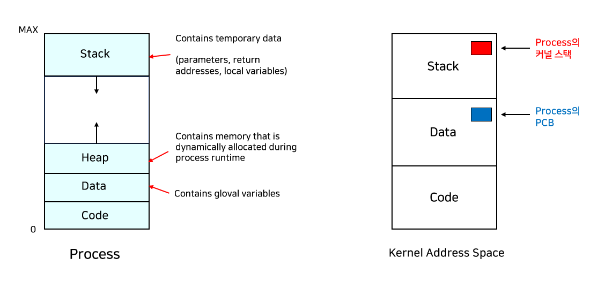

# 💽 Operating System (운영체제)

###### content
- [운영체제(OS)란?](#운영체제란) 
  - 정의
  - 기능
- [프로세스](#프로세스)  
<br>
<br>
<br>

---
## 운영체제란?

### ■ 운영체제(OS)의 정의
- 사용자가 컴퓨터를 쉽게 다룰 수 있게 해주는 인터페이스
- 컴퓨터 자원을 효율적으로 관리하기 위한 시스템
- 컴퓨터 사용자와 컴퓨터 하드웨어 간의 인터페이스로서 동작하는 시스템 소프트웨어의 일종
- 컴퓨터 응용 프로그램 관리자
- 하드웨어와 소프트웨어를 관리하는 소프트웨어 전체  
- Windows(윈도우), Linux(리눅스), UNIX(유닉스), Mas OS 등
<br>
<br>

💡 **소프트웨어(Softmware)**  
- 크게 시스템 소프트웨어(OS)와 응용 소프트웨어(서드파티 앱)
- 시스템 소프트웨어는 자체적으로 구동 가능
- 응용 소프트웨어는 시스템 소프트웨어 없이 구동 불가  
<br>

💡 **펌웨어(Firmware)**  
- 특정 하드웨어 장치에 포함된 소프트웨어
- 전자기기 등의 기본적인 제어 및 구동을 맡는 소프트웨어
- 프로그램의 형태를 갖추고 있으므로 기능적으로는 소프트웨어에 가깝지만 하드웨어 내부(주로 ROM)에 위치하며, 사용자가 쉽게 그 내용을 바꿀 수 없으므로 하드웨어적인 특성도 함께 가지고 있음
- 펨웨어 예 : 바이오스(BIOS), 스마트폰 등등  
<br>
<br>

### ■ 운영체제의 기능  
#### 1. 자원 관리  
  - 메모리 관리
  - 프로세스 관리
  - 입출력 장치 관리
  - 파일 관리  
<br>
    
#### 2. 시스템 관리
  - 시스템 보호
  - 네트워킹
  - 명령 해석기  
<br>

<details>
  <summary>상세기능</summary>
  <div markdown="1">
    <ul>
      <li>프로세서, 기억장치, 입출력장치, 파일 및 정보 등의 자원을 관리한다.</li>
      <li>자원을 효율적으로 관리하기 위해 자원의 스케줄링 기능을 제공한다.</li>
      <li>사용자와 시스템간의 편리한 인터페이스를 제공한다.</li>
      <li>시스템의 각종 하드웨어와 네트워크를 관리, 제어한다.</li>
      <li>데이터를 관리하고, 데이터 및 자원의 공유 기능을 제공한다.</li>
      <li>시스템의 오류를 검사하고 복구한다.</li>
      <li>자원 보호 기능을 제공한다.</li>
      <li>입출력에 대한 보조 기능을 제공한다.</li>
      <li>가상 계산기 능력을 제공한다.  </li>
    </ul>
  </div>
</details>

<br>
<br>
<br>


### 함께 보면 좋은 자료
[🔗 [블로그] Rebro의 코딩 일기장 - [운영체제(OS)] 1. Overview](https://rebro.kr/170?category=504670)  
[🔗 [유튜브] 얄팍한 코딩사전 - 프로세스는 뭐고 스레드는 뭔가요?](https://youtu.be/iks_Xb9DtTM)  
[🔗 [유튜브] 기술노트with알렉 - 컴퓨터구조 운영체제 클라우드 안쉬고 처음부터 끝까지 30분동안 설명하기](https://youtu.be/uMyKBYF48nY)  
<br>


##### [🔼 목차로 이동](#content)
---
## 프로세스

### ■ 프로세스(Process) 란?
- 실행 중인 프로그램
- 디스크에 있는 프로그램이 메모리에 로드되면 프로세스가 됨
- 하나의 프로그램이 여러 프로세스가 될 수 있음
- 디스크로부터 메모리에 적재되어 CPU의 할당을 받을 수 있는 것
- 스택(Stack), 힙(Heap), 데이터(Data), 코드(Code)로 나뉨  
<br>

### ■ 프로세스 컨텍스트(Process Context)
```프로세스의 특정 시점의 정확한 상태를 나타내기 위한 정보```

프로세스의 실행은 Program Counter(PC)가 프로세스의 Code를 가리키면서 명령어를 하나씩 읽고, CPU에 가져와서 Register에 값을 넣고, 산술논리연산 장치에서 연산을 하고, 결과를 Register나 프로세스의 메모리에 저장한다.  

이러한 프로세스의 특정 시점의 정확한 상태를 나타내기 위한 정보. 즉, 프로세스가 현재 어떤 상태에서 수행되고 있는지 정확히 규명하기 위해 필요한 정보를 프로세스 컨텍스트라고 한다.  

프로세스는 Time-Sharing방식으로 진행되기 때문에 각 프로세스의 컨텍스트를 알아야 실행이 멈췄다 다시 진행될 때 바로 이어서 실행이 가능하다.

프로세스 컨텍스트는 아래 4가지를 포함한다.

#### 1. 하드웨어 컨텍스트(Hardware Context)  
  - CPU의 수행상태를 나타낸다.
  - 프로그램 카운터(Program Counter), 각종 레지스터(Register)가 있다.  
  - 이들을 이용하여 해당 프로세스가 어디까지 실행되었는지를 알 수 있다.  

#### 2. 프로세스의 주소 공간(Address space)
  - 현재 시점의 프로세스의 code, data, stack에 어떤 값이 들어있는지 알 수 있다.

#### 3. 프로세스 관련 커널 자료구조 PCB(Process Control Block)
  - 운영체제가 각 프로세스를 관리하기 위해 프로세스별로 보유하고 있는 자신의 정보 묶음이다.
  - 운영체제는 프로세스가 시작할 때마다 자신의 data영역에 해당 프로세스의 제어 블록을 가진다.

#### 4. 프로세스 커널 스택(Process Kernel Stack)
  - 프로세스가 자신이 처리할 수 없는 일을 운영체제에 요청할 수 있다.
  - 시스템 콜이 발생하면 PC는 커널의 code를 가리키고 커널의 함수를 호출한다. 이 때, 각 프로세스마다 호출하는 code를 관리하기 위해 프로세스 별 커널 스택을 갖는다.  
<br>

  

###### 이미지 출처 : https://rebro.kr/172?category=504670


<br>
<br>
<br>

### 함께 보면 좋은 자료
[🔗 [강의] KOCW - 운영체제](http://www.kocw.net/home/cview.do?cid=3646706b4347ef09#.Y1ls9fqJizU.link)  
[🔗 [유튜브] 주니온TV 아무거나연구소 - 운영체제: 03. 프로세스의 이해](https://youtu.be/Hgr6oGlDK_E)  

### Reference
[🔗 [블로그] Rebro의 코딩 일기장 - [운영체제(OS)] 3. 프로세스(Process)](https://rebro.kr/172?category=504670)  
[🔗 [블로그] 구름 개발일기장 - 3주차.Process 정리](https://ws-pace.tistory.com/20)  
<br>

##### [🔼 목차로 이동](#content)
---