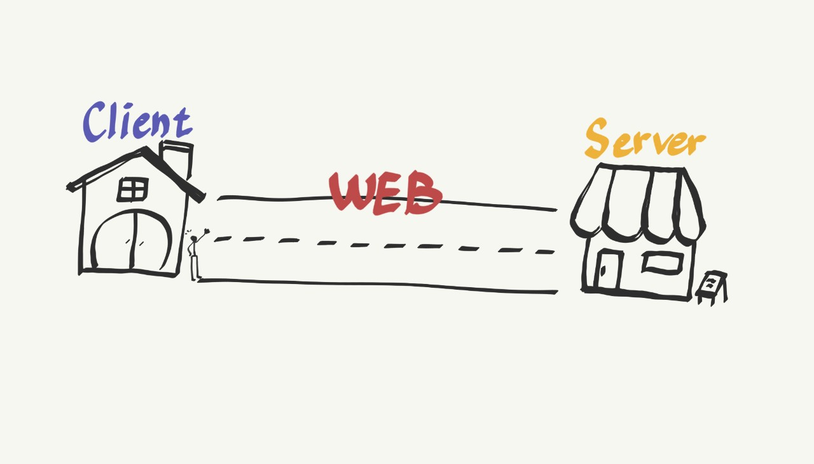

# 웹의 동작 방식

###### content

- [서문]

- [클라이언트와 서버]
  - Client
  - Server

 
 
 

---

## 서문

> *'웹의 동작 방식'*은 여러분의 컴퓨터나 폰의 웹 브라우저 안에서 웹페이지를 볼 때 무슨 일이 발생하는지에 대한 간소화된 개념을 제공할 것입니다.
>   >  
> 이 이론은 단기적으로 봤을 때 웹 코드를 작성하기 위해 필수적인 것은 아니지만, 머지 않아 백그라운드에서 발생하는 것을 이해하는 것으로부터 오는 장점을 얻게 될 것입니다.

   
   
   

---

## 클라이언트와 서버

 

 

지금은, **웹**이 도로라고 상상해봅시다. 도로의 한 쪽 끝은 여러분의 집, **클라이언트** 입니다. 다른 한 쪽 끝은 여러분이 뭔가를 사길 원하는 상점, **서버**입니다.

 
 
 

---

## Client

- 네트워크를 통하여 서버라는 다른 컴퓨터 시스템 상의 원격 서비스에 접속할 수 있는 응용 프로그램이나 서비스를 말한다.

 
 
 

---

### 함께 보면 좋은 자료

[🔗 YOUTUBE 생활코딩: WEB1-17. 인터넷을 여는 열쇠 : 서버와 클라이언트](https://www.youtube.com/watch?v=yBPyzaccbkc&t=306s)

### Reference

[🔗 MDN 웹의 동작 방식](https://developer.mozilla.org/ko/docs/Learn/Getting_started_with_the_web/How_the_Web_works)
 
[🔗 wiki 클라이언트(컴퓨팅)](<https://ko.wikipedia.org/wiki/%ED%81%B4%EB%9D%BC%EC%9D%B4%EC%96%B8%ED%8A%B8_(%EC%BB%B4%ED%93%A8%ED%8C%85)>)

 
 
 

---
